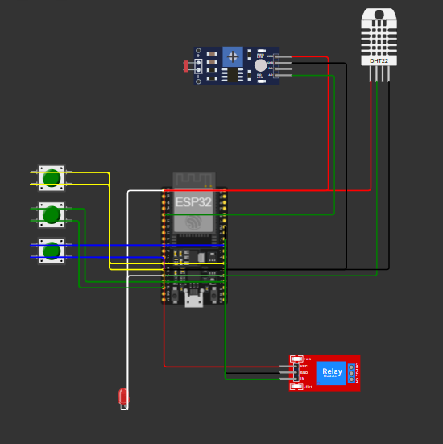

Fase 2 — Sistema de Irrigação Inteligente com ESP32

Nesta fase foi desenvolvido um sistema embarcado utilizando ESP32 com foco em Agricultura Digital e automação de irrigação. O projeto simula uma plantação inteligente capaz de monitorar condições ambientais e tomar decisões automáticas sobre irrigação.

Foram utilizados sensores para representar diferentes variáveis agrícolas: o DHT22 para medição de umidade, um LDR para simular variações de pH do solo e botões para representar os níveis de nutrientes N, P e K (Nitrogênio, Fósforo e Potássio). Com base nesses dados, o sistema avalia as condições da plantação.

A lógica implementada define que a irrigação deve ser ativada quando a umidade do solo estiver abaixo do ideal ou quando os níveis de nutrientes e pH estiverem fora da faixa considerada adequada para a cultura simulada. A saída do sistema é representada por um relé, que simula o acionamento de uma bomba de irrigação.

Essa fase introduz conceitos de Internet das Coisas (IoT), automação e tomada de decisão baseada em sensores, servindo como base para a integração com banco de dados na fase seguinte do projeto.

## 📷 Circuito da Fase 2

