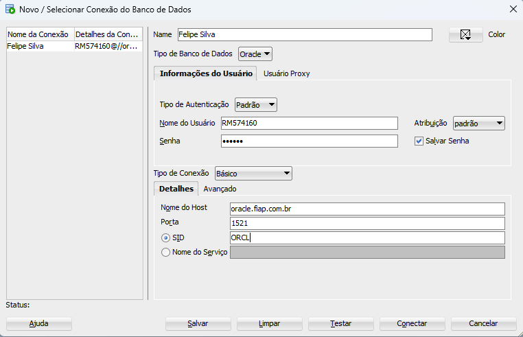
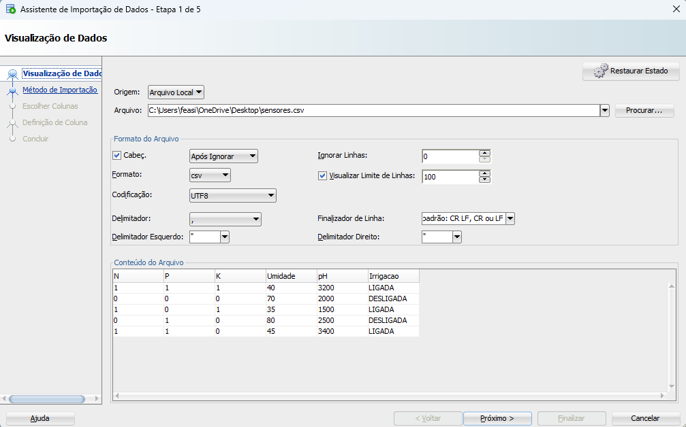
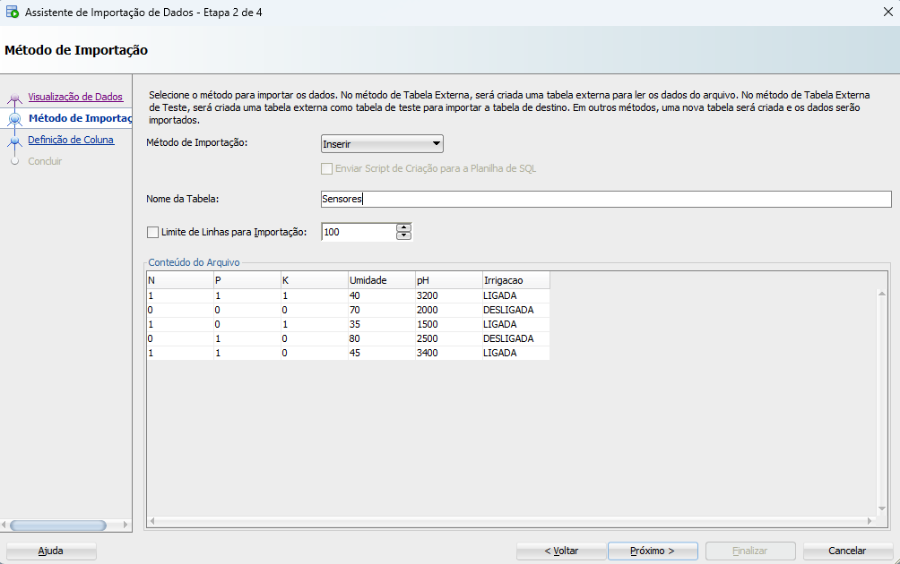
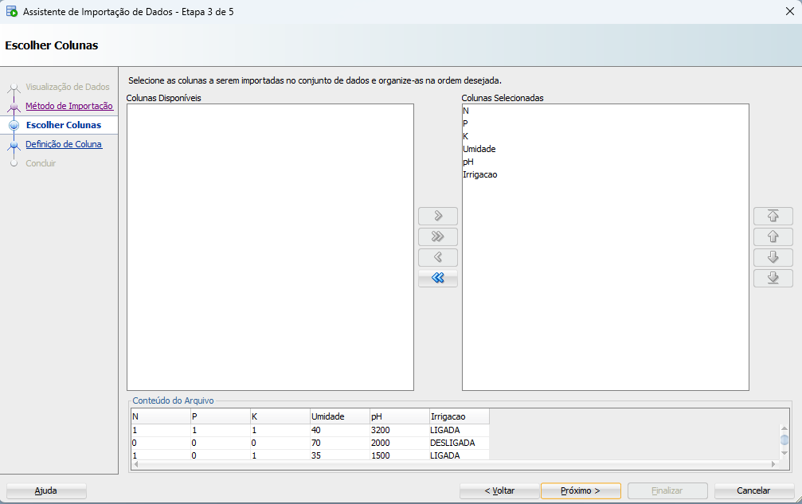
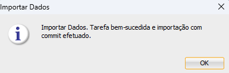

## Fase 3 — Armazenamento e Análise de Dados no Oracle

## 🎥 Vídeo Demonstrativo

[Assistir vídeo](https://www.youtube.com/watch?v=PnWUtswbAZo)

Nesta fase foi realizada a importação dos dados gerados na Fase 2 para um banco de dados Oracle utilizando o SQL Developer. Os dados coletados pelos sensores da simulação IoT foram organizados em formato CSV e importados para uma tabela relacional.

Após a importação, foram realizadas consultas SQL para análise dos dados, permitindo a visualização e extração de informações relevantes como média de umidade, níveis de pH e valores máximos e mínimos dos sensores.

Essa etapa tem como objetivo integrar os dados gerados no sistema IoT com um banco de dados relacional, possibilitando análises mais estruturadas e preparação para aplicações de Data Science e tomada de decisão na agricultura inteligente.

## 📷 Prints do passo a passo realizado para a criação do banco de dados

Criando o Banco de dados

Adicionando o arquivo .csv feito na FASE 2

Adicionando nome da nova tabela

Colunas Selecionadas

Mensagem de confirmação que a tabela foi criada com sucesso

## 📷 Prints SELECT do Oracle SQL Developer

Select mostrando todos os dados

Select mostrando saída de quando a irrigação está ligada

Select mostrando saída de quando a umidade está baixa

