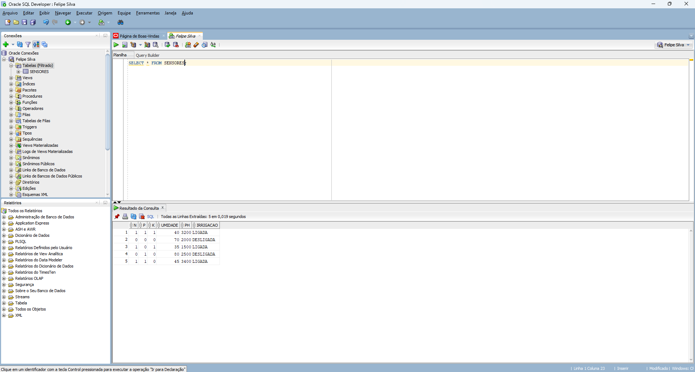
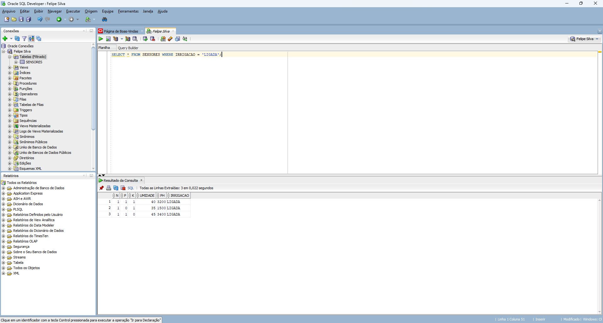
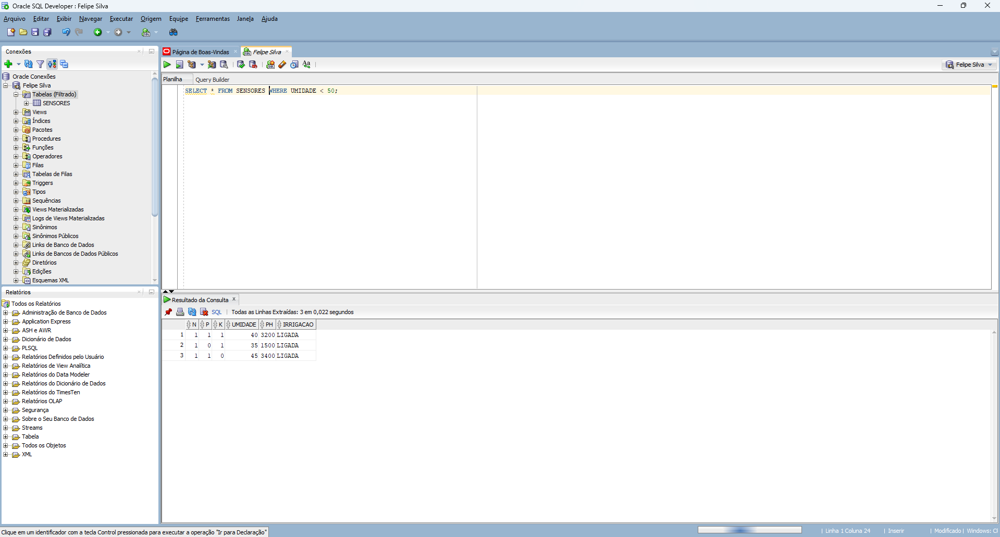

## Fase 3 — Armazenamento e Análise de Dados no Oracle

Nesta fase foi realizada a importação dos dados gerados na Fase 2 para um banco de dados Oracle utilizando o SQL Developer. Os dados coletados pelos sensores da simulação IoT foram organizados em formato CSV e importados para uma tabela relacional.

Após a importação, foram realizadas consultas SQL para análise dos dados, permitindo a visualização e extração de informações relevantes como média de umidade, níveis de pH e valores máximos e mínimos dos sensores.

Essa etapa tem como objetivo integrar os dados gerados no sistema IoT com um banco de dados relacional, possibilitando análises mais estruturadas e preparação para aplicações de Data Science e tomada de decisão na agricultura inteligente.

## 📷 Prints do Oracle SQL Developer

